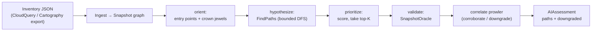
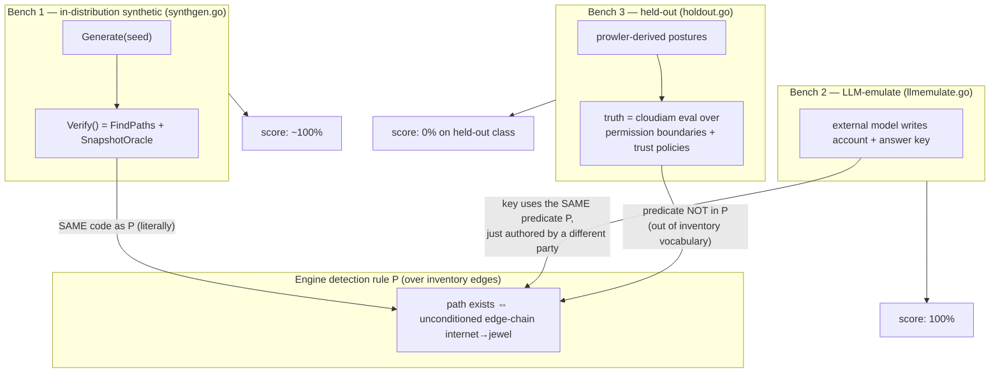

# Why the AI Cloud Engineer scores 100% — and why that is overfitting

This document explains the test workflow for the AI Cloud Security Engineer
(`internal/cloudengine`), why three different benchmarks report the numbers they
do, and the precise sense in which the 100% scores are **overfitting** rather
than capability.

TL;DR: **the engine's accuracy is bounded by its representation.** Every test that
scores 100% is confined to the cloud-inventory vocabulary, and *within that
vocabulary the engine is correct by construction*. The one test that defines
truth *outside* that vocabulary drops the engine to **0%**. The 100% is a property
of the representation, not of the engineer.

---

## 1. The engine pipeline (the thing under test)

The detection rule, stated plainly:

> Report an attack path **iff** there is a chain of inventory edges
> (`network_reach`, `runs_as`, `assume_role`, `has_access`, `privesc`) from
> `internet` / a public resource to a crown jewel (sensitive data or privileged
> identity), with **no blocking `condition`** on any edge.

That single predicate — *call it `P`* — is the whole engine. Everything else
(scoring, narrative, remediation) is downstream of `P`.

---

## 2. The three benchmarks and where "truth" comes from

The only thing that distinguishes a meaningful benchmark from a meaningless one is
**how the ground truth is defined**, relative to `P`.

### Bench 1 — in-distribution synthetic → ~100% (purely circular)

`Verify()` establishes ground-truth reachability by calling **`FindPaths` +
`SnapshotOracle`** — *the exact functions the engine scores with*. The ground
truth **is** the code under test. There are only two topologies (one real, one
decoy), and every decoy is inert for one reason (a condition on one edge). A 100%
here proves the graph/traversal/oracle are internally consistent. Nothing more.

### Bench 2 — LLM-emulate → 100% (independent author, but same predicate)

Here the generator is genuinely independent: an external model (Gemini) writes the
account **and** the answer key with no knowledge of the engine. That rules out the
Bench-1 circularity… but the score is still 100%, and here is why:

> The model can only describe the account using the **inventory vocabulary**
> (`reaches`, `runs_as`, `trusts`, `grants`, `privescs`, edge `condition`,
> `sensitive`, `public`). When it labels a path "real", it means *an unconditioned
> edge-chain to a jewel exists*. When it labels a finding "inert", it means *no
> such chain* (no path, or a condition, or not a jewel). **That is the predicate
> `P` verbatim.** The model and the engine are computing the same function over
> the same vocabulary — so they agree by construction, up to bugs.

The independence is real, but it buys generalization to **novel topologies, names,
and sizes within `P`** — not generalization beyond `P`. The shared **inventory
schema is the leak**: it cannot express any reachability dimension the engine
ignores, so the generator is structurally unable to produce a case the engine
gets wrong.

### Bench 3 — held-out → 0% (truth defined outside `P`)

The held-out bench computes truth with an **independent oracle the engine never
runs** — the IAM effective-permissions evaluator (`cloudiam`) over **permission
boundaries** and **trust policies**. These live *outside* the inventory
vocabulary, so they are outside `P`. The engine over-approximates (it traverses an
assume edge regardless of the target's trust policy; it adds a privesc edge from
attached policies without consulting the boundary) and **false-positives every
held-out case → 0% FP-reduction, 80/80 false paths**.

---

## 3. Why "100%" is overfitting, stated exactly

| Bench | Ground-truth source | Same predicate as engine? | Score | What it actually measures |
|---|---|---|---|---|
| in-distribution | engine's own `FindPaths`+oracle | **identical code** | ~100% | internal consistency (a regression test) |
| LLM-emulate | independent model, inventory vocabulary | **same predicate `P`** | 100% | generalization *within* `P` (real, but bounded) |
| held-out | independent `cloudiam` over boundaries+trust | **different predicate** | **0%** | generalization *beyond* `P` (the true gap) |

The pattern is the punchline:

- **Score = 100% ⇔ truth was defined using the engine's own predicate `P`.**
- **Score = 0% ⇔ truth was defined using a predicate `P` does not implement.**

So the 100% is **overfitting to the representation**: the engine has memorized
nothing, but its competence envelope is *exactly* the inventory vocabulary, and
every 100% test lives inside that envelope. A real AWS account's exploitability
depends on dimensions the vocabulary drops — effective permissions under
boundaries/SCPs, role trust policies, network-ACL semantics, resource policies —
and on those the engine is at 0% until they are modeled.

---

## 4. The fix (how to make the 100% mean something)

> **Status: implemented for the CloudQuery source** (`internal/cloudquery`). A
> real CloudQuery sync carries role trust policies + permission boundaries as
> first-class columns, and `cloudquery.ToInventory` resolves effective
> permissions (cloudiam over `attached ∧ boundary`, plus trust-policy gating on
> assume) before emitting edges. On a prowler-grounded CloudQuery account
> (`tsbench cloud-engine --cloudquery`) the engineer now correctly downgrades the
> boundary-blocked privesc and the trust-denied assume — the exact classes the
> held-out bench flagged. The naive synthetic ingest paths (`synthgen`,
> `holdout`) still over-approximate by design, which is why
> `TestHoldout_ExposesOverfitGap` remains a tripwire for those.

The held-out bench is not just a critique; it is a checklist. tsengine **already
has** the evaluator that computes the correct answer (`cloudiam`); the gap is that
graph **ingest does not consult it** for these dimensions. Closing it:

1. **Extend the inventory schema** to carry the dropped dimensions: role trust
   policies, permission boundaries, SCPs, resource policies, network ACLs.
2. **Make ingest evaluate them with `cloudiam`** before adding edges: gate an
   `assume_role` edge on the target trust policy; gate a `privesc` edge on
   `attached ∧ boundary ∧ scp`; gate `has_access` on resource policy.
3. **Re-run the held-out bench.** When `TestHoldout_ExposesOverfitGap` flips from
   tripwire to PASS, the predicate `P` has grown to include those dimensions — and
   *then* the LLM-emulate generator can also produce them, so its 100% finally
   means "correct over a vocabulary that matches reality."

Until then, the honest reading is:

- **In-distribution 100%** → the code is internally consistent. (Keep as a
  regression gate.)
- **LLM-emulate 100%** → the engine generalizes within the modeled vocabulary.
  (Genuine, but do not over-read it.)
- **Held-out 0%** → the modeled vocabulary is narrower than reality. (This is the
  number that should drive the roadmap.)
